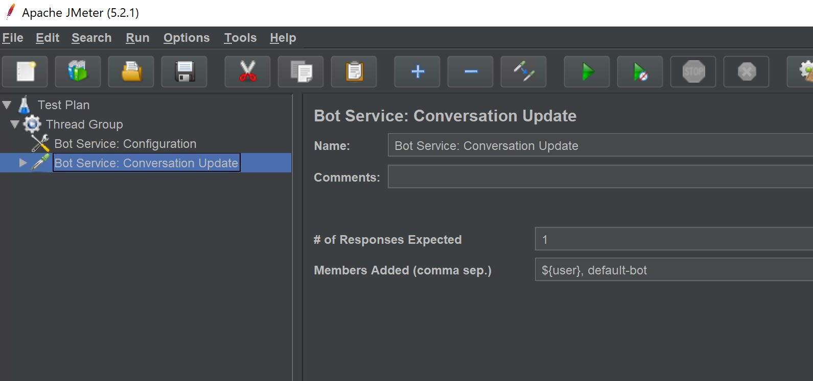

# How to do load test for deployed bot?
I had a project which I need a load test for deployed bot.
There was a blog post, but it doesn't give the detailed description how to configure load test environment for deployed bot so I wrote this tutorial.

## 1. Prerequisite
Up and running bot! (If not, you can deploy one of the sample bots on github)


## 2. Prepare a VM for Load Testing 
### Create a VM for Load Test Client (For Windows OS)
This is the original blog post that I followed to setup the environment. 
* [Stress Testing Bots in Azure Bot Service using Apache JMeter - Part 1](https://medium.com/microsoftazure/stress-testing-bots-in-azure-bot-service-using-apache-jmeter-part-1-3b440737fd8a)

### Change default setting of VM
1. Create **Windows Server 2019 Datacenter** vm on Azure.


2. Turn off **IE Enhanced Security Configuration**

To install the following programs, you need to change the security setting for IE.

3. Turn off **Windows Firewall** setting like below.


### Install JDK
1. Download [JDK](https://jdk.java.net/) 

2. Add system variable for "JAVA_HOME"

3. Add this to the PATH

> You need to restart your VM after edit environment variable. 
4. Restart your VM and check if JDK installed 


### Install Apache JMeter
* Reference: [https://www.mkyong.com/maven/how-to-install-maven-in-windows/](https://www.mkyong.com/maven/how-to-install-maven-in-windows/)
1. Download [Apache JMeter](https://jmeter.apache.org/).

2. Extract zip file.


### Install Apache Maven
* Reference: [https://www.mkyong.com/maven/how-to-install-maven-in-windows/](https://www.mkyong.com/maven/how-to-install-maven-in-windows/)
1. Download [Apache Maven](https://maven.apache.org/download.cgi)


2. Extract zip file

3. Add "MAVEN_HOME" as a system variable


4. Add this variable to PATH


5. Restart the VM and check the maven version


### Clone BotServiceStressToolkit project and create JAR file 
1. Clone [BotServiceStressToolkit](https://github.com/damadei/BotServiceStressToolkit) project on Github
    > If you want to use git clone, you need to download git(https://git-scm.com/) first.

2. Move to "BotServiceStressToolkit" directory 

3. Execute following command.
    ```
    mvn clean package
    ```
    

4. Copy the JAR file under **target** folder after step3 completed.


5. Paste those JAR files under Apache JMeter **~/lib/ext**


## 3. Execute Load Testing for the bot
### Configuration for test VM on Azure Portal
> I use 45678 port for this, but this can be any port number you prefer.
1. Open Azure portal and go to the VM you create
2. Go to network setting page

3. Add **inbound port rule** like below.


### Configuration for Apache JMeter
1. Open Apache JMeter under Apache JMeter **~/bin/jmeter.bat**


2. Create **Thread group**


3. Create **Bot Service: Configuration**


4. Update the configuration info for deployed bot.

    Those are the field you need to update
    * Bot URL: http://**your-app-service-name**.azurewebsites.net/api/messages
    * Callback URL: http://**your-vm-public-ip**:**your-port-number**
    * Callback Server Listen Host: **your-vm-private-ip**
    * Callback Server Listen Port: **your-port-number**

5. Create **Bot Service: Security Configuration**


6. Update AppId and App Secret


5. Create **Bot Service: Conversation Update**

 
6. Modify the Conversation Update setting


7. Add "View Result Tree"


9. Add "Aggregate Report"


9. Save this flow before run the test


10. Check the test result


11. Increase thread 1 to 100(as many as you want) for load test.


You can add assertion and so on. If you want to know more detail on this, please read the blog post below!
* [Stress Testing Bots in Azure Bot Service using Apache JMeter - Part 1](https://medium.com/microsoftazure/stress-testing-bots-in-azure-bot-service-using-apache-jmeter-part-1-3b440737fd8a)
* [Github: BotServiceStressToolkit](https://github.com/damadei/BotServiceStressToolkit)


